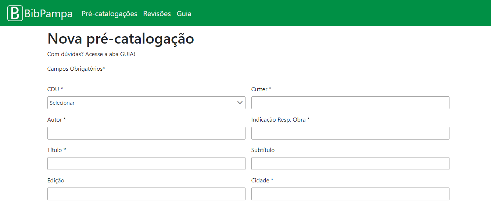
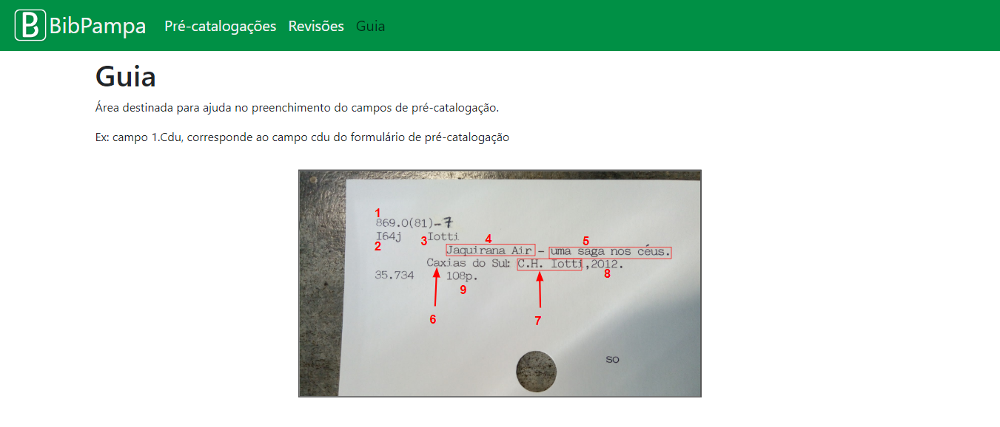
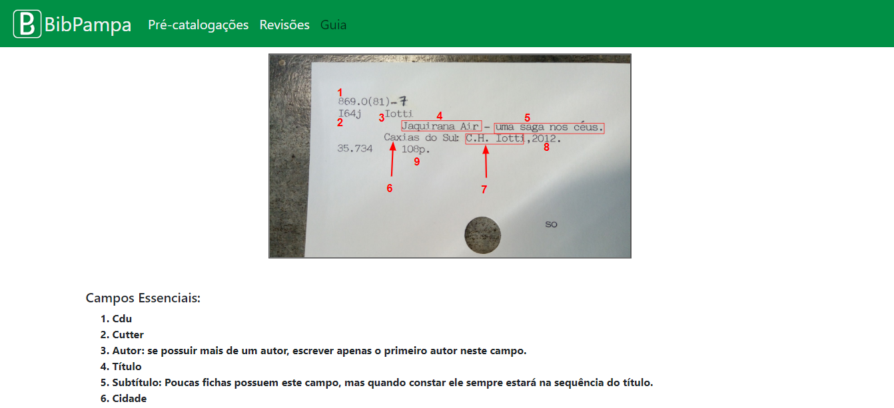
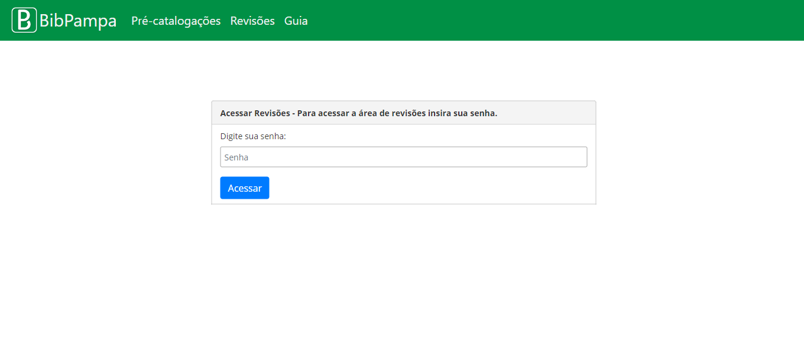
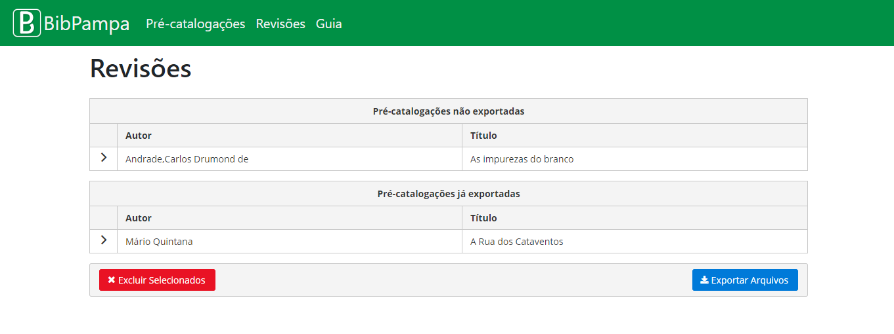

# BibPampa

Sistema para pré-catalogar livros de literatura inglesa, americana e brasileira. Este software foi construído inicial mente para a biblioteca Mário Quintana de Alegrete, onde através dele é possível pré-catalogar fichas catalográficas e exportá-las em formato marc21. Os arquivos exportados podem ser importados no BibLivre através da opção de importação contida no Biblivre.

## Screenshots do sistema

Tela Principal

Tela Guia

Tela Guia (campos)

Tela Login

Tela Revisões

### Começando

O Bibpampa é dividido em dois projeto. O *backend*, construído com Spring Boot, e o *front* com Angular, primeng e bootstrap.

Para contribuir com o *backend* deste projeto, siga os seguintes passos:

1. Baixar este projeto;
2. Abrir o projeto no Netbeans 10.0;
3. Aguardar o maven baixar todas as dependências;
4. Trabalhar no projeto.

Para contribuir com o *frontend* deste projeto, siga os seguintes passos:

1. Baixar o projeto do [Google Drive](https://drive.google.com/open?id=1uYd6aYooSuTre0Onq11C30HUdgoWRg4w);
2. Abrir o projeto em um editor de preferência (recomendo o Visual Studio Code);
3. Baixar dependências do node, primeng, bootstrap no angular cli;
4 Trabalhar no projeto.

Se algum projeto não funcionar, uma opção é buscar tutorias sobre como rodar projetos em tais tecnologias. Ou criar uma issue.

## Deploy das Aplicações

para realizar deploy das aplicações, deve-se gerar o build do backend no netbeans, e o build do front no visual studio code (foi a ide que eu usei para o front).

Após os builds terem sido gerados, deve se colocar os dois builds na pasta webapp do tomcat. o tomcat que eu usei foi o 8.5, rodando na porta 8090. Ambos os projetos já estão configurados para rodar nessa porta.

## Built With

* [Netbeans](https://netbeans.apache.org/download/nb100/nb100.html) - IDE para programar o *backend*
* [Visual Studio Code](https://code.visualstudio.com) - IDE para programar o *frontend*
* [Tomcat](https://tomcat.apache.org/download-80.cgi) - Servidor da aplicação
* [MySql](https://dev.mysql.com/downloads/installer/) - Gerenciador de banco de dados
* [Spring Boot](https://spring.io/projects/spring-boot) - Projeto para criar APIs em java
* [Angular](https://angular.io) - Framework javascript para criação de aplicações web, mobile e desktop

